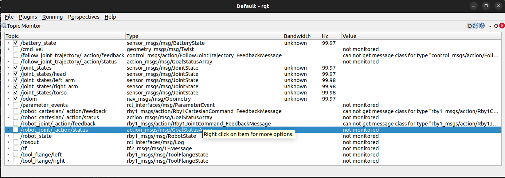
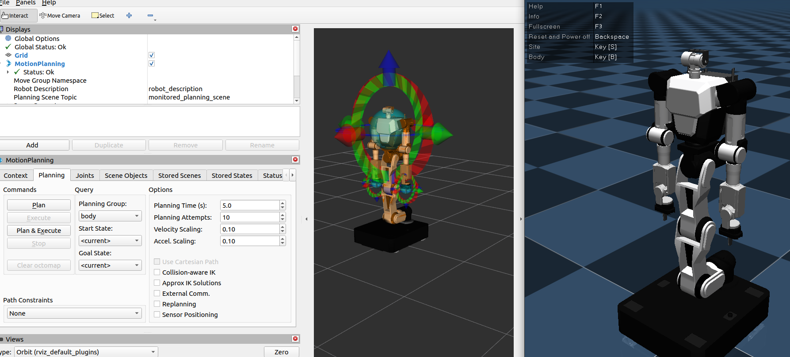
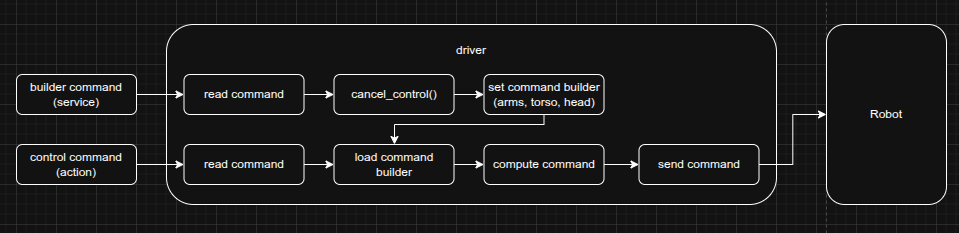

# RBY1 ROS 2 Driver Package

> [!CAUTION]
> ## The current driver is in beta. For safe use, please test the features in a simulation first.
> Please note that package contents, APIs, topics, and parameters may change continuously during the beta period.

## Overview

`rby1_ros2` is a unified ROS 2 driver package for controlling the Rainbow Robotics RBY1 robot.  
It wraps the RBY1 C++ SDK into a ROS 2 node, providing state monitoring and multiple control modes (Joint Position, Cartesian Position, Impedance, Gravity Compensation, and Trajectory Streaming) through a clean action/service/topic interface.

- **ROS 2 version**: Humble
- **OS**: Ubuntu 22.04
- **SDK compatibility**: rby1-sdk `0.10.x` and later

---

## 1. Quick Start

- **If you install in an environment such as conda or miniforge, issues may arise due to Python and CMake path conflicts, so please install it in a local environment.**

### 1-1. Install ROS 2 Humble

<https://docs.ros.org/en/humble/Installation/Ubuntu-Install-Debs.html>

### 1-2. Install RB-Y1 SDK

<https://github.com/RainbowRobotics/rby1-sdk>

### 1-3. Install RBY1 Simulator (Docker)

<https://hub.docker.com/r/rainbowroboticsofficial/rby1-sim>

### 1-4. Install MoveIt 2

- Please proceed up to  `~ Optional: add the previous command to your .bashrc`

<https://moveit.picknik.ai/humble/doc/tutorials/getting_started/getting_started.html>

- Install additional tool

```bash
sudo apt install ros-humble-gripper-controllers
sudo apt install ros-humble-joint-trajectory-controller
```

### 1-5. Environment Setup

Add the following lines to `~/.bashrc`:

```bash
sudo nano ~/.bashrc

# Add at the bottom:
export PATH=/opt/cmake/bin:$PATH
source /opt/ros/humble/setup.bash

# Apply changes
source ~/.bashrc
```

### 1-5. Build

```bash
mkdir -p rby1_ros2_ws/src
cd rby1_ros2_ws/src
git clone https://github.com/RainbowRobotics/rby1_ros2.git
cd ..
colcon build --symlink-install
source install/setup.bash
```

### 1-6. Configure `driver_parameters.yaml`

Located at `rby1_driver/config/driver_parameters.yaml`.  
Edit this file to match your robot before launching the driver.  
Because the workspace was built with `--symlink-install`, **no rebuild is needed** after editing.

> [!IMPORTANT]
> For simulation testing, keep `robot_ip: "127.0.0.1:50051"`.  
> Some state values (battery, tool flange FT/IMU) will show zeros in simulation because no physical sensors are attached.

- Main Parameters(for the detail of driver_parameters.yaml, see [here](#50-configdriver_parametersyaml))

| Parameter | Default | Unit | Description |
|-----------|---------|------|-------------|
| `robot_ip` | `"127.0.0.1:50051"` | - | Robot IP address and gRPC port |
| `model` | `"m"` | - | Robot model — `"a"` (RBY1-A) or `"m"` (RBY1-M) |
| `get_state_period` | `0.01` | s | State publish interval — default 0.01(100 Hz) |
| `publish_battery_state` | `true` | - | Enable battery state topic |
| `publish_tool_flange_state` | `true` | - | Enable tool flange state topics (left + right) |

---

> [!NOTE]
> **`get_state_period` and communication frequency:**  
> `get_state_period` sets the interval (in seconds) at which the driver reads the robot state via `GetState()` and publishes all state topics.  
> Actual throughput may be slightly lower (97–100 Hz) depending on PC environment and CPU load.



### 1-7. Run Simulator (optional)

If you do not have a physical robot, run the Docker simulator.  
The robot IP in this case is `"127.0.0.1:50051"` or `"localhost:50051"`.  
Change the tag at the end to select a model/version (e.g. `a_v1.2`, `m_v1.3`).

```bash
# Example: Model A, firmware v1.2
sudo docker run --rm \
  -e DISPLAY=${DISPLAY} \
  -v /tmp/.X11-unix:/tmp/.X11-unix \
  -p 50051:50051 \
  rainbowroboticsofficial/rby1-sim:0.10.6-a_v1.2
```

> [!IMPORTANT]
> ## Model `a` only supports firmware up to v1.2. Model `m` supports v1.0–v1.3.

---

### 1-8. Launch the Driver

```bash
# In your workspace root
source install/setup.bash

# Option A: Launch normally
ros2 launch rby1_driver rby1_ros2_driver.launch.py

```

### 1-9. Run Examples

Each example can be run in a **separate terminal** while the driver is active:
```bash
source install/setup.bash
ros2 run rby1_examples <example_name>
```

| Example | Command | Description |
|---------|---------|-------------|
| `01_power_control` | `ros2 run rby1_examples 01_power_control` | Full power lifecycle: Power ON/OFF, Servo ON/OFF |
| `02_robot_status_monitor` | `ros2 run rby1_examples 02_robot_status_monitor` | Comprehensive state monitor (Motor state, brakes, battery, FT) |
| `03_tool_flange_monitoring` | `ros2 run rby1_examples 03_tool_flange_monitoring` | Continuously prints tool flange FT/IMU/IO data |
| `04_joint_state_monitoring` | `ros2 run rby1_examples 04_joint_state_monitoring` | Prints per-component joint positions in real time |
| `05_gravity_compensation` | `ros2 run rby1_examples 05_gravity_compensation` | Enables/Disable gravity compensation (direct teaching) mode |
| `06_zero_pose` | `ros2 run rby1_examples 06_zero_pose` | Moves all joints to 0 rad simultaneously |
| `07_joint_command` | `ros2 run rby1_examples 07_joint_command` | Sends Ready Pose → Zero Pose via joint position action |
| `08_cartesian_command` | `ros2 run rby1_examples 08_cartesian_command` | Moves the arms to a target Cartesian pose |
| `09_multi_controls` | `ros2 run rby1_examples 09_multi_controls` | Simultaneous joint + Cartesian control per body part |
| `10_trajectory_joint_command` | `ros2 run rby1_examples 10_trajectory_joint_command` | Streams a pre-computed trajectory via standard FollowJointTrajectory action |
| `11_cancel_control` | `ros2 run rby1_examples 11_cancel_control` | Demonstrates action cancel and `cancel_control` service |
| `12_mobile_base_control` | `ros2 run rby1_examples 12_mobile_base_control` | Drives the mobile base via `cmd_vel`|
| `13_stream_command` | `ros2 run rby1_examples 13_stream_command` | Alternates Zero/Ready poses using regular joint commands over persistent stream with varying wait intervals |
| `14_collision_safety_control` | `ros2 run rby1_examples 14_collision_safety_control` | use collision value in robot.state, Demonstrates that when collision happens, robot automatically moves retreat to initial safe pose.  |

---

> [!IMPORTANT]
> **Two ways to stop control commands (see Example 11):**
> 1. **Action cancel** — Cancels only the current action goal. The stream remains open, so subsequent commands can continue immediately.
> 2. **`cancel_control` service** — Immediately stops all control commands **and forcibly closes the stream** for safety.
>
> ⚠️ **If you are using stream-based control (e.g., `cmd_vel`, Example 13), calling `cancel_control` will also shut down the stream.**  
> You will need to re-open the stream (`/stream_control state: true`) before sending further commands.  
> If you only want to pause or cancel a specific motion while keeping the stream alive, use the action cancel instead (see Example 13).

## 2. Visualization & Robot Description (`rby1_description`)

You can use the robot's basic TF structure and state publisher through the commands below. When implementing features related to rby1, please use the model files from the corresponding package.

- **Parameters**:
  - `model_name` : `rby1a`, `rby1m`
  - `model_version`
    - `rby1a` : `1.0`, `1.1`, `1.2`
    - `rby1m` : `1.0`, `1.1`, `1.2`, `1.3`

```bash
source install/setup.bash
ros2 launch rby1_description rby1_state_publisher.launch.py model:=a version:=1_1
```

1. If you launch this command, you can see the following window:


2. Click 'Add', and add plugins `TF` and `RobotModel`:


3. Click 'Fixed Frame' and set to `base`:


4. Click 'RobotModel', and select Topics -> `/robot_description`:


5. You can now control the robot model using the joint state publisher GUI:


---

## 3. RB-Y1 MoveIt 2 (`rby1_hardware` + `rby1_moveit_*`)

The `rby1_hardware` package provides a `ros2_control` `SystemInterface` plugin (`rby1_hardware/RBY1SystemHardware`) that bridges the RBY1 SDK to MoveIt 2 via the standard `ros2_control` pipeline.  
Each `rby1_moveit_*` package contains the complete MoveIt 2 configuration (SRDF, kinematics, joint limits, controller configs) for a specific model and firmware version.



### 3-1. Available MoveIt Packages

| Package | Model | Firmware |
|---------|-------|---------|
| `rby1_moveit_a_1_0` | RBY1-A | v1.0 |
| `rby1_moveit_a_1_1` | RBY1-A | v1.1 |
| `rby1_moveit_a_1_2` | RBY1-A | v1.2 |
| `rby1_moveit_m_1_0` | RBY1-M | v1.0 |
| `rby1_moveit_m_1_1` | RBY1-M | v1.1 |
| `rby1_moveit_m_1_2` | RBY1-M | v1.2 |
| `rby1_moveit_m_1_3` | RBY1-M | v1.3 |

### 3-2. Launch MoveIt with Real Hardware

> [!IMPORTANT]
> **Real hardware mode** requires `rby1_driver` to be running first.  
> `RBY1SystemHardware` claims hardware control from the driver via the `/hardware_control` service on activation.
> Please check robot ip & model in `rby1_driver/config/driver_parameters.yaml`
>
> [!WARNING]
> **Version mismatch risk**: The `rby1_hardware` plugin cannot verify the connected robot's firmware version at runtime.  
> If the `rby1_moveit_*` package version does not match the actual robot firmware version, MoveIt and the robot may be activated with different joint/kinematic configurations, which could cause unexpected commands to be sent to the robot.  
> **Always ensure the `rby1_moveit_*` package version matches the robot's firmware version before launching with real hardware.**

**Step 1** — Start the driver (first terminal):

```bash
source install/setup.bash
ros2 launch rby1_driver rby1_ros2_driver.launch.py
```

**Step 2** — Launch MoveIt (second terminal), selecting the package that matches your model and firmware version:

```bash
# open another terminal
source install/setup.bash

# Real hardware (default: use_fake_hardware:=false)
ros2 launch rby1_moveit_m_1_2 demo.launch.py

# With a custom robot IP
ros2 launch rby1_moveit_m_1_2 demo.launch.py robot_ip:=192.168.30.1:50051

# Fake hardware / simulation (no real robot required)
ros2 launch rby1_moveit_m_1_2 demo.launch.py use_fake_hardware:=true
```

Replace `rby1_moveit_m_1_2` with the package matching your robot.

### 3-3. Launch Arguments

| Argument | Default | Description |
|----------|---------|-------------|
| `use_fake_hardware` | `false` | `true` = `mock_components/GenericSystem` (no robot needed); `false` = `RBY1SystemHardware` (real robot) |
| `robot_ip` | `127.0.0.1:50051` | RBY1 SDK gRPC address and port |
| `model` | `m` or `a` | Robot model type passed to the hardware plugin |

### 3-4. ros2_control Controllers

Each MoveIt package spawns the following controllers:

| Controller | Type | Controlled Joints |
|------------|------|------------------|
| `right_arm_controller` | `JointTrajectoryController` | right_arm_0 ~ ee_right |
| `left_arm_controller` | `JointTrajectoryController` | left_arm_0 ~ ee_left |
| `torso_controller` | `JointTrajectoryController` | base ~ torso_5 |
| `head_controller` | `JointTrajectoryController` | head_0, head_1 |
| `gripper_r_controller` | `GripperActionController` | gripper_finger_r1_joint |
| `gripper_l_controller` | `GripperActionController` | gripper_finger_l1_joint |
| `both_arms_controller` | `JointTrajectoryController` | All arm joints (left + right) |
| `body_controller` | `JointTrajectoryController` | Torso + Head + Both Arms |
| `joint_state_broadcaster` | `JointStateBroadcaster` | All hardware joints |


## 4. Troubleshooting & Known Issues

### Issue: MoveIt Known Issues (MoveIt 관련 알려진 문제)

#### ⚠️ Warning: `Missing gripper_finger_r2_joint` / `gripper_finger_l2_joint`

```
[WARN] The complete state of the robot is not yet known. Missing gripper_finger_r2_joint
```

**Cause**: `gripper_finger_r2_joint` and `gripper_finger_l2_joint` are **mimic joints** (linked to `r1`/`l1` via `<mimic>` in the URDF) and are not registered in `ros2_control`. The `joint_state_broadcaster` does not publish state for them, so MoveIt's planning scene monitor raises this warning.

**Impact**: **None** — motion planning and execution for all controlled joints works correctly. This warning can be safely ignored.

#### ⚠️ Hardware Control Handoff

When `ros2 launch rby1_moveit_* demo.launch.py` is launched with real hardware, the `RBY1SystemHardware` plugin calls `/hardware_control state:=true` to take exclusive control from the driver. During this period, direct action commands sent to the driver (e.g. `robot_joint`) will be rejected. Control is returned to the driver when MoveIt is shut down (`Ctrl+C`).

### Issue: Control Commands Rejected After Trajectory Stream Interruptions (스트림 제어 노드 급작 종료 시 제어 불가 현상)

* **Symptom (증상)**: 
  If a stream-based trajectory control node (e.g., using persistent trajectory streams) is suddenly terminated or killed mid-operation, the driver's stream state remains active. Until this stream mode is explicitly closed, the driver will reject all other incoming joint or Cartesian motion commands, resulting in errors.
  
  스트림 통신(궤적 스트리밍 등)을 수행하던 중 노드가 갑자기 강제 종료(중단)된 경우, 드라이버 측에서는 스트림이 계속 동작 중인 것으로 간주하여 스트림이 유지됩니다. 이 스트림 모드를 끄기 전까지는 다른 일반 제어 명령이 모두 거부되며 오류가 발생합니다.
  
* **Resolution (해결 방법)**: 
  You must manually disable the streaming state by calling the `/stream_control` service with `state: false` in a separate terminal. This terminates the lingering stream and restores normal control capabilities.
  
  별도의 터미널을 열고 아래의 서비스를 호출하여 스트림 제어 모드를 강제로 비활성화(`false` 전송)한 후 정상적으로 제어 명령을 다시 실행해 주시기 바랍니다:

  ```bash
  ros2 service call /stream_control rby1_msgs/srv/StateOnOff "{state: false}"
  ``` 

### Issue: Driver Shutdown on Startup due to Collision (시뮬레이션 구동 시 충돌로 인한 드라이버 강제 종료 현상)

* **Symptom (증상)**:
  If you launch the driver while the robot is already in a collision state (especially common when launching in simulation where default/initial joint states overlap), the driver will detect the collision and immediately log a FATAL error and terminate for safety.
  
  시뮬레이션에서 이미 충돌이 난 상황에서 드라이버를 킬 경우, 충돌로 인해 드라이버가 강제로 종료된다.
  
* **Resolution (해결 방법)**:
  Temporarily decrease the `collision_threshold` parameter in `driver_parameters.yaml` (e.g. to a very small value or `0.0`), launch the driver safely, command the robot joints to move to a safe, non-colliding pose, and then restore `collision_threshold` to its original value.
  
  따라서 `collision_threshold`를 더 줄인 상태에서 구동을 한 후 자세를 안전하게 이동시켜 사용하기를 바란다.

### Issue: Client-Side Warnings `Ignoring unexpected goal/result response` (예제/클라이언트 노드에서 경고 로그 출력 현상)

* **Symptom (증상)**:
  When running sequential Python examples (e.g., `13_stream_command`), the terminal outputs warnings like `Ignoring unexpected goal response. There may be more than one action server for the action 'robot_joint'` or `Ignoring unexpected result response`.
  This occurs because:
  1. Persistent streaming makes the action server return success immediately. If the client completes the goal before the Python client-side state machine processes the goal acceptance, a race condition occurs.
  2. Standard blocking calls like `time.sleep()` prevent the ROS 2 executor thread from spinning, causing DDS status updates to accumulate and get processed out of order during the next goal spin.
  
  파이썬 예제나 클라이언트 노드를 순차적으로 실행할 때 `Ignoring unexpected goal response` 또는 `Ignoring unexpected result response` 경고 로그가 발생하는 현상입니다.
  이는 다음과 같은 원인으로 발생합니다:
  1. 지속성 스트림 사용 시 드라이버가 명령을 즉시 수락하고 성공을 반환하는데, 클라이언트단에서 이 성공 결과를 액션 수락 메시지 처리 완료 전에 먼저 받으면 경주 상황(Race Condition)이 발생합니다.
  2. 일반적인 블로킹 함수인 `time.sleep()` 등을 사용하면 ROS 2 익스큐터가 회전(spin)하지 못해 DDS 메시지 큐가 처리되지 않고 누적되다가 다음 명령 시점에 강제 처리되면서 순서가 어긋납니다.

* **Resolution (해결 방법)**:
  1. The C++ driver has been updated to introduce a 50ms delay (`std::this_thread::sleep_for(std::chrono::milliseconds(50))`) before completing streaming commands to ensure the client-side state machine is ready.
  2. In your sequential Python nodes, avoid using standard `time.sleep()`. Instead, implement a non-blocking spin-sleep function (e.g., `rclpy.spin_once` in a loop) to keep draining the DDS network queue:
  
  1. C++ 드라이버 단에서 스트림 명령 처리에 성공했을 때 약 50ms의 지연(`sleep_for`)을 추가하여 클라이언트가 수락 상태 전이를 마칠 시간을 확보하도록 수정되었습니다.
  2. 순차 스크립트를 작성할 때는 `time.sleep()` 대신 루프 내에서 `rclpy.spin_once(node, timeout_sec=...)`를 호출하는 비블로킹 `spin_sleep` 형태의 대기 루프를 구현하여 사용하십시오.

> [!NOTE]
> **Simulator Limitation**: Battery voltage, FT sensor, and IMU data read as `0.0` in simulation (no physical hardware).
> **Tool flange topics**: Requires `publish_tool_flange_state: true` in `driver_parameters.yaml`.

---

## 4. Key Features

### Robot Control
- **Joint Position Control**: Command each body part (Torso, Right/Left Arm, Head) to target joint angles (rad) via the `robot_joint` action. All parts can be commanded simultaneously in one goal.
- **Cartesian Position Control**: Command end-effector pose as a 4×4 SE3 transform via the `robot_cartesian` action.
- **Impedance Control**: Both joint and Cartesian modes support impedance control with configurable stiffness and damping.
- **Gravity Compensation**: Enables back-drivable joints for direct teaching; the driver continuously compensates gravity.
- **Trajectory Streaming**: Send a pre-computed `JointTrajectory` (multi-waypoint) via the standard `follow_joint_trajectory` action.
- **Mobile Base + Upper Body Simultaneous Control**: While driving the base via `cmd_vel`, you can also command the arms/head via the `robot_joint` action at the same time. Set `priority = 1` on upper-body goals to match the mobile base's default priority.

### State Monitoring
- Joint states (position, velocity, torque) are published at up to 100 Hz per body part.
- A unified `robot_state` topic provides Control Manager state, brake status, EMO, CoM, and stream open/close status in one message.
- Optional battery state and per-flange FT/IMU data can be enabled in `driver_parameters.yaml`.

### Safety & Fault Management
- Motion commands are rejected if the Control Manager is not in `ENABLE` or `EXECUTING` state.
- Minor faults encountered during execution are automatically reset and control is resumed.

### Collision Features

#### Always-On Collision Detection
Self-collision monitoring is **always active** regardless of any parameter settings. The driver monitors link distances reported by the SDK on every state read cycle (`get_state_period`). When the minimum link distance falls below `collision_threshold`, the driver immediately calls `CancelControl()` and closes the stream.

#### Predictive Collision Checking
The driver checks the **target pose** for collisions *before* executing any joint or Cartesian command:
- **Joint commands**: uses the URDF-based dynamics model to evaluate the target joint configuration for link collisions.
- **Cartesian commands**: solves the Inverse Kinematics via the built-in optimal control solver to obtain joint angles, then evaluates those angles for collisions.
- If the predicted configuration is in collision (minimum distance below the threshold), the driver prints a warning log (`RCLCPP_WARN`) rather than aborting or rejecting the command, allowing safer manual intervention.
- ⚠️ This check runs at the same rate as `get_state_period`. A slow period means the check fires less frequently.

---

## 5. Package Structure & Architecture

### 5-0. Config/driver_parameters.yaml

| Parameter | Default | Unit | Description |
|-----------|---------|------|-------------|
| `robot_ip` | `"127.0.0.1:50051"` | - | Robot IP address and gRPC port |
| `model` | `"m"` | - | Robot model — `"a"` (RBY1-A) or `"m"` (RBY1-M) |
| `get_state_period` | `0.01` | s | State publish interval — default 100 Hz |
| `minimum_time` | `2.0` | s | Default minimum execution time for motion commands |
| `angular_velocity_limit` | `4.712` | rad/s | Joint angular velocity limit |
| `linear_velocity_limit` | `1.5` | m/s | Cartesian linear velocity limit |
| `acceleration_limit` | `1.0` | - | Acceleration scaling factor |
| `se2_minimum_time` | `1.0` | s | Minimum execution time (interpolation ramp) for SE2 velocity commands |
| `se2_linear_acceleration_limit` | `0.5` | m/s² | Linear acceleration limit for SE2 velocity commands |
| `se2_angular_acceleration_limit` | `0.5` | rad/s² | Angular acceleration limit for SE2 velocity commands |
| `fault_reset_trigger` | `true` | - | Auto-reset MAJOR/MINOR fault on driver startup |
| `collision_threshold` | `0.01` | m | Minimum link-distance threshold for collision detection (always active) |
| `publish_battery_state` | `true` | - | Enable battery state topic |
| `publish_tool_flange_state` | `true` | - | Enable tool flange state topics (left + right) |

---

### 5-1. Package Structure

| Package | Role |
|---------|------|
| `rby1_driver` | C++ main driver node. Wraps the RBY1 SDK and exposes a ROS 2 interface. |
| `rby1_msgs` | Custom message, service, and action definitions for robot control and state. |
| `rby1_examples` | Python example scripts demonstrating all major driver features. |
| `rby1_description` | Robot description for ROS, demonstrating URDF and Mesh files, and simple visualization launch file. |
| `rby1_hardware` | `ros2_control` SystemInterface plugin (`RBY1SystemHardware`). Bridges the RBY1 SDK to MoveIt 2 via the standard `ros2_control` hardware interface pipeline. |
| `rby1_moveit_a_1_0` | MoveIt 2 configuration package for **Model A v1.0** (SRDF, controllers, kinematics, joint limits). |
| `rby1_moveit_a_1_1` | MoveIt 2 configuration package for **Model A v1.1**. |
| `rby1_moveit_a_1_2` | MoveIt 2 configuration package for **Model A v1.2**. |
| `rby1_moveit_m_1_0` | MoveIt 2 configuration package for **Model M v1.0**. |
| `rby1_moveit_m_1_1` | MoveIt 2 configuration package for **Model M v1.1**. |
| `rby1_moveit_m_1_2` | MoveIt 2 configuration package for **Model M v1.2**. |
| `rby1_moveit_m_1_3` | MoveIt 2 configuration package for **Model M v1.3**. |

### 5-2. System Architecture



```
[User Node / Example]
        │
   ROS 2 Topics / Services / Actions
        │
  ┌─────▼────────────────────┐
  │   rby1_ros2_driver (C++) │
  │  ┌────────────────────┐  │
  │  │   State Publisher  │  │  ← reads robot state via SDK, publishes ROS topics
  │  ├────────────────────┤  │
  │  │  Service Handlers  │  │  ← power, servo, brake, gravity comp, CM commands
  │  ├────────────────────┤  │
  │  │  Action Servers    │  │  ← joint commands, Cartesian commands, streaming
  │  └────────────────────┘  │
  └─────────────────┬────────┘
                    │ gRPC
             ┌──────▼──────┐
             │  RBY1 Robot │
             │  (or Sim)   │
             └─────────────┘
```

**Key internal components:**
- **State Loop**: Calls `GetState()` and `GetControlManagerState()` at `get_state_period` intervals and publishes all state topics.
- **Action Executors**: Each action goal is translated into an SDK `CommandBuilder` command and executed synchronously. Minor faults during execution trigger automatic reset and recovery.
- **Safety Guard**: All motion commands are rejected unless the Control Manager is in `ENABLE` or `EXECUTING` state.
- **Collision Detection** (always active): Self-collision is monitored every `get_state_period`. `CancelControl()` and stream close are called automatically if link distance falls below `collision_threshold`.
- **Predictive Collision Check**: Before executing a command, the driver evaluates the target joint configuration (or solves IK for Cartesian targets) against the URDF collision model and prints a warning if a collision is predicted.

---

## 6. Control Manager States

The `RobotState.control_manager_state` field (and the `robot_state` topic) uses the following integer constants, also accessible as `RobotState.STATE_*`:

| Value | Constant | Description |
|-------|----------|-------------|
| `0` | `STATE_NONE` | Driver not initialized or disconnected |
| `1` | `STATE_IDLE` | Control Manager is disabled (IDLE) |
| `2` | `STATE_ENABLE` | Control Manager is active and holding position |
| `3` | `STATE_EXECUTING` | A motion command is currently being executed |
| `4` | `STATE_MAJOR_FAULT` | Unrecoverable hardware fault — requires reset |
| `5` | `STATE_MINOR_FAULT` | Recoverable fault — driver auto-resets by default |

---

## 7. Communication Interfaces

### 7-1. Topics (Publishers)

| Topic | Type | Always Active | Description |
|-------|------|:---:|-------------|
| `joint_states/torso` | `sensor_msgs/JointState` | ✅ | Torso joint positions, velocities, torques |
| `joint_states/right_arm` | `sensor_msgs/JointState` | ✅ | Right arm joint state |
| `joint_states/left_arm` | `sensor_msgs/JointState` | ✅ | Left arm joint state |
| `joint_states/head` | `sensor_msgs/JointState` | ✅ | Head joint state |
| `robot_state` | `rby1_msgs/RobotState` | ✅ | Control Manager state, brakes, EMO, CoM, tool flange connection |
| `battery_state` | `sensor_msgs/BatteryState` | ⚙️ `publish_battery_state` | Battery voltage, current, percentage |
| `tool_flange/left` | `rby1_msgs/ToolFlangeState` | ⚙️ `publish_tool_flange_state` | Left flange: FT sensor, IMU, switch, voltage, digital I/O |
| `tool_flange/right` | `rby1_msgs/ToolFlangeState` | ⚙️ `publish_tool_flange_state` | Right flange: FT sensor, IMU, switch, voltage, digital I/O |
| `odom` | `nav_msgs/Odometry` | ✅ | High-rate robot odometry and TF broadcast relative to node namespace |

### 7-2. Topics (Subscribers)

| Topic | Type | Description |
|-------|------|-------------|
| `cmd_vel` | `geometry_msgs/Twist` | Velocity command for driving base wheels (linear x, y and angular z) |

> [!IMPORTANT]
> **Mobile Base Control (`cmd_vel`) streaming requirement:**
> Since `cmd_vel` acts as a high-frequency publisher, **you must enable persistent stream control** before publishing base velocity commands.
> - Call `/stream_control` with `state: true` before sending `cmd_vel` commands.
> - Call `/stream_control` with `state: false` after finishing base control to return to regular position hold.
> - Attempting to activate `/stream_control` when already active is idempotent; the service will safely log a warning and return success.
> - ⚠️ **Calling `cancel_control` while using stream-based control will also close the stream.** After `cancel_control`, you must re-open the stream before sending further `cmd_vel` commands. To cancel only the current motion without closing the stream, use the action cancel (see Example 13).
> - The current stream open/close state is reflected in the `robot_state` topic as `robot_stream_state` (`bool`).
>
> [!WARNING]
> **Behavior of `robot_joint` and `robot_cartesian` Actions under Active Stream:**
> When persistent streaming is active (`stream_control` is `true`), the single joint (`robot_joint`) and Cartesian (`robot_cartesian`) commands are also routed through the command stream (`stream_handler_`).
> - In this mode, these actions will return a success (`succeed`) status **immediately** after sending the command, without waiting for the robot to reach the target position or providing intermediate feedback.
> - Therefore, target completion checking must be done independently by monitoring the joint state topics.
>
> **Joint/Cartesian Action Behavior Characteristics When Persistence Stream is Enabled:**
> - When `robot_joint` and `robot_cartesian` action commands are sent while the persistence stream is turned on, those commands are transmitted through the stream channel.
> - In this case, it **returns immediately** without waiting for the robot to reach the target position; therefore, the client side must monitor whether the target has been reached via a separate joint status topic.
>
> ⚙️ = controlled by the corresponding flag in `driver_parameters.yaml`

### 7-3. Services

| Service | Type | Description |
|---------|------|-------------|
| `robot_power` | `rby1_msgs/StateOnOff` | Power ON/OFF. `parameters`: `"all"`, `"48v"`, `"5v"`, etc. |
| `robot_servo` | `rby1_msgs/StateOnOff` | Servo ON/OFF. `parameters`: `"all"`, joint/part names |
| `tool_flange_power` | `rby1_msgs/StateOnOff` | Set tool flange voltage. `parameters`: `"12v"`, `"24v"`, `"48v"` (ON) or `""` (OFF) |
| `gravity_compensation` | `rby1_msgs/GravityCompensation` | Enable/disable gravity compensation per body part |
| `cancel_control` | `std_srvs/Trigger` | Cancel all active motion commands immediately |
| `get_cartesian_pose` | `rby1_msgs/GetCartesianPose` | Query Cartesian transform between two links |
| `control_manager_command` | `rby1_msgs/ControlManagerCommand` | Send `CMD_ENABLE` / `CMD_DISABLE` / `CMD_RESET` to the Control Manager |
| `stream_control` | `rby1_msgs/StateOnOff` | Enable/disable persistent streaming mode with 10-minute hold times (`state=true` to enable, `state=false` to disable) |
| `hardware_control` | `rby1_msgs/StateOnOff` | Claim (`state=true`) or release (`state=false`) hardware control rights for direct controller managers |

#### `ControlManagerCommand` constants

| Constant | Value | Description |
|----------|-------|-------------|
| `CMD_NONE` | `0` | No operation |
| `CMD_ENABLE` | `1` | Enable the Control Manager (start position hold) |
| `CMD_DISABLE` | `2` | Disable the Control Manager (transition to IDLE) |
| `CMD_RESET` | `3` | Reset MAJOR/MINOR fault and return to IDLE |

### 7-4. Action Servers

| Action Server | Type | Description |
|---------------|------|-------------|
| `robot_joint` | `rby1_msgs/Rby1JointCommand` | Whole-body joint position command. Each body part (torso, right_arm, left_arm, head) can be commanded independently in a single goal. |
| `robot_cartesian` | `rby1_msgs/Rby1CartesianCommand` | Whole-body Cartesian command. Each arm and torso can be assigned an . geometry_msgs/msg/Transform.msg (position, quaternion)|
| `follow_joint_trajectory` | `control_msgs/FollowJointTrajectory` | Standard ROS 2 trajectory execution action server (used directly by MoveIt). |

---

## 8. Custom Message Types

### `rby1_msgs/JointCommand` (used inside `Rby1JointCommand` goals)

| Field | Type | Default | Description |
|-------|------|---------|-------------|
| `joint_names` | `string[]` | — | Optional joint name list |
| `position` | `float64[]` | — | Target joint positions (rad) |
| `minimum_time` | `float64` | `2.0` | Minimum execution time (s) |
| `velocity_limit` | `float64` | `4.7` | Joint velocity limit (rad/s) |
| `acceleration_limit` | `float64` | `1.0` | Acceleration scaling |
| `use_impedance` | `bool` | `false` | Use joint impedance instead of position control |
| `stiffness` | `float64[]` | — | Impedance stiffness coefficients |
| `damping_ratio` | `float64` | `1.0` | Impedance damping ratio |
| `torque_limit` | `float64` | `10.0` | Impedance torque safety limit (N·m) |

### `rby1_msgs/CartesianCommand` (used inside `Rby1CartesianCommand` goals)

| Field | Type | Description |
|-------|------|-------------|
| `target_link` | `string` | Name of the end-effector link to control |
| `ref_link` | `string` | Reference coordinate frame link |
| `transform` | `float64[16]` | Row-major 4×4 homogeneous transform matrix |
| `minimum_time` | `float64` | Minimum execution time (s) |
| `use_impedance` | `bool` | Use Cartesian impedance instead of position control |

### `rby1_msgs/RobotState`

| Field | Type | Description |
|-------|------|-------------|
| `control_manager_state` | `int32` | Current Control Manager state (see constants above) |
| `brake_state` | `BrakeState` | Brake engagement per joint (left_arm[], right_arm[], torso[], head[]) |
| `tool_flange_state` | `bool[]` | Tool flange connection status `[left, right]` |
| `emo_state` | `bool` | Emergency Stop pressed status |
| `center_of_mass` | `float64[3]` | Calculated CoM position `[x, y, z]` in meters |
| `robot_stream_state` | `bool` | `true` if the persistent command stream is currently open, `false` if closed |

### `rby1_msgs/ToolFlangeState`

| Field | Type | Description |
|-------|------|-------------|
| `ft_force` | `float64[3]` | Force `[Fx, Fy, Fz]` in Newtons |
| `ft_torque` | `float64[3]` | Torque `[Tx, Ty, Tz]` in N·m |
| `gyro` | `float64[3]` | Gyroscope `[roll, pitch, yaw]` in rad/s |
| `acceleration` | `float64[3]` | Accelerometer `[ax, ay, az]` in m/s² |
| `switch_a` | `bool` | Physical switch A state |
| `output_voltage` | `int32` | Output voltage in millivolts |
| `digital_input_a/b` | `bool` | Digital input A/B state |
| `digital_output_a/b` | `bool` | Digital output A/B state |

---

