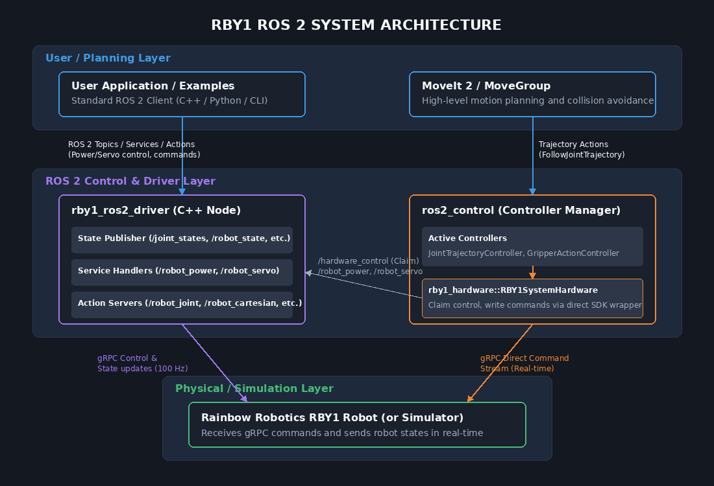

# RBY1 ROS 2 Driver Package

> [!CAUTION]
> ## The current driver is in beta. For safe use, please test the features in a simulation first.

## Overview

`rby1_ros2` is a unified ROS 2 driver package for controlling the Rainbow Robotics RBY1 robot.  
It wraps the RBY1 C++ SDK into a ROS 2 node, providing state monitoring and multiple control modes (Joint Position, Cartesian Position, Impedance, Gravity Compensation, and Trajectory Streaming) through a clean action/service/topic interface.

- **ROS 2 version**: Humble
- **OS**: Ubuntu 22.04
- **SDK compatibility**: rby1-sdk `0.10.x` and later

---

## 1. Quick Start

- **If you install in an environment such as conda or miniforge, issues may arise due to Python and CMake path conflicts, so please install it in a local environment.**

### 1-1. Install ROS 2 Humble

<https://docs.ros.org/en/humble/Installation/Ubuntu-Install-Debs.html>

### 1-2. Install RB-Y1 SDK

<https://github.com/RainbowRobotics/rby1-sdk>

### 1-3. Install RBY1 Simulator (Docker)

<https://hub.docker.com/r/rainbowroboticsofficial/rby1-sim>

### 1-4. Install MoveIt 2(optional)

> [!CAUTION]
> if you'll not use MoveIt, pleasse delete moveit package(rby1_moveit folder) in workspace.

- Please proceed up to  `~ Optional: add the previous command to your .bashrc`

<https://moveit.picknik.ai/humble/doc/tutorials/getting_started/getting_started.html>

- Install additional tool

```bash
sudo apt install ros-humble-gripper-controllers
sudo apt install ros-humble-joint-trajectory-controller
```

### 1-5. Environment Setup

Add the following lines to `~/.bashrc`:

```bash
sudo nano ~/.bashrc

# Add at the bottom:
export PATH=/opt/cmake/bin:$PATH
source /opt/ros/humble/setup.bash

# Apply changes
source ~/.bashrc
```

### 1-5. Build

```bash
mkdir -p rby1_ros2_ws/src
cd rby1_ros2_ws/src
git clone https://github.com/RainbowRobotics/rby1_ros2.git
cd ..
colcon build --symlink-install
source install/setup.bash
```

### 1-6. Configure `driver_parameters.yaml`

Located at `rby1_driver/config/driver_parameters.yaml`.  
Edit this file to match your robot before launching the driver.  
Because the workspace was built with `--symlink-install`, **no rebuild is needed** after editing.

> [!IMPORTANT]
> If you use simulation for testing, keep `robot_ip: "127.0.0.1:50051"`.  
> Some state values (battery, tool flange FT/IMU) will show zeros in simulation because no physical sensors are attached.

- Main Parameters(for the detail of driver_parameters.yaml, see [here](#50-configdriver_parametersyaml))

| Parameter | Default | Unit | Description |
|-----------|---------|------|-------------|
| `robot_ip` | `"127.0.0.1:50051"` | - | Robot IP address and gRPC port |
| `model` | `"m"` | - | Robot model — `"a"` (RBY1-A) or `"m"` (RBY1-M) |
| `get_state_period` | `0.01` | s | State publish interval — default 0.01(100 Hz) |
| `publish_battery_state` | `true` | - | Enable battery state topic |
| `publish_tool_flange_state` | `true` | - | Enable tool flange state topics (left + right) |

---

> [!NOTE]
> **`get_state_period` and communication frequency:**  
> `get_state_period` sets the interval (in seconds) at which the driver reads the robot state via `GetState()` and publishes all state topics.  
> Actual throughput may be slightly lower (97–100 Hz) depending on PC environment and CPU load.


### 1-7. Run Simulator (optional)

If you do not have a physical robot, run the Docker simulator.  
The robot IP in this case is `"127.0.0.1:50051"` or `"localhost:50051"`.  
Change the tag at the end to select a model/version (e.g. `a_v1.2`, `m_v1.3`).

```bash
# Example: Model A,  v1.2
sudo docker run --rm \
  -e DISPLAY=${DISPLAY} \
  -v /tmp/.X11-unix:/tmp/.X11-unix \
  -p 50051:50051 \
  rainbowroboticsofficial/rby1-sim:0.10.6-a_v1.2
```

> [!IMPORTANT]
> ## Model `a` only supports  up to v1.2. Model `m` supports v1.0–v1.3.

---

### 1-8. Launch the Driver

```bash
# In your workspace root
source install/setup.bash

# Option A: Launch normally
ros2 launch rby1_driver rby1_ros2_driver.launch.py

```

### 1-9. Run Examples

Each example can be run in a **separate terminal** while the driver is active:
```bash
source install/setup.bash
ros2 run rby1_examples <example_name>
```

| Example | Command | Description |
|---------|---------|-------------|
| `01_power_control` | `ros2 run rby1_examples 01_power_control` | Full power lifecycle: Power ON/OFF, Servo ON/OFF |
| `02_robot_status_monitor` | `ros2 run rby1_examples 02_robot_status_monitor` | Continuously prints state monitor (Motor state, brakes, battery, etc) |
| `03_tool_flange_monitoring` | `ros2 run rby1_examples 03_tool_flange_monitoring` | Continuously prints tool flange data |
| `04_joint_state_monitoring` | `ros2 run rby1_examples 04_joint_state_monitoring` | Prints per-component joint positions in real time |
| `05_gravity_compensation` | `ros2 run rby1_examples 05_gravity_compensation` | Enables/Disable gravity compensation mode |
| `06_zero_pose` | `ros2 run rby1_examples 06_zero_pose` | Moves all joints to 0 rad simultaneously |
| `07_joint_command` | `ros2 run rby1_examples 07_joint_command` | Sends Ready Pose with joint_position(right), joint_impedance(left) |
| `08_cartesian_command` | `ros2 run rby1_examples 08_cartesian_command` | Sends Ready Pose and moves the arms to a target Cartesian pose with cartesian_position(right), cartesian_impedance(left)|
| `09_multi_controls` | `ros2 run rby1_examples 09_multi_controls` | Simultaneous joint + Cartesian control per body part |
| `10_trajectory_joint_command` | `ros2 run rby1_examples 10_trajectory_joint_command` | Streams a pre-computed trajectory via standard FollowJointTrajectory action |
| `11_cancel_control` | `ros2 run rby1_examples 11_cancel_control` | Demonstrates action cancel and `cancel_control` service |
| `12_mobile_base_control` | `ros2 run rby1_examples 12_mobile_base_control` | Drives the mobile base via `cmd_vel`|
| `13_stream_command` | `ros2 run rby1_examples 13_stream_command` | Alternates Zero/Ready poses using regular joint commands over persistent stream with varying wait intervals |
| `14_collision_safety_control` | `ros2 run rby1_examples 14_collision_safety_control` | use collision value in robot.state, Demonstrates that when collision happens, robot automatically moves retreat to initial safe pose.  |

---

> [!IMPORTANT]
> **Two ways to stop control commands (see Example : 11_cancel_control):**
> 1. **Action cancel** — Cancels only the current action goal. The stream remains open, so subsequent commands can continue immediately.
> 2. **`cancel_control` service** — Immediately stops all control commands **and forcibly closes the stream** for safety.
>
> ⚠️ **If you are using stream-based control (e.g., `cmd_vel`, Example 13), calling `cancel_control` will also shut down the stream.**  
> You will need to re-open the stream (`/stream_control state: true`) before sending further commands.  
> If you only want to pause or cancel a specific motion while keeping the stream alive, use the action cancel instead (see Example 13).

## 2. Visualization & Robot Description (`rby1_description`)

You can use the robot's basic TF structure and state publisher through the commands below. When implementing features related to rby1, please use the model files from the corresponding package.

- **Parameters**:
  - `model_name` : `rby1a`, `rby1m`
  - `model_version`
    - `rby1a` : `1.0`, `1.1`, `1.2`
    - `rby1m` : `1.0`, `1.1`, `1.2`, `1.3`

```bash
source install/setup.bash
ros2 launch rby1_description rby1_state_publisher.launch.py model:=a version:=1_1
```

1. If you launch this command, you can see the following window:


2. Click 'Add', and add plugins `TF` and `RobotModel`:


3. Click 'Fixed Frame' and set to `base`:


4. Click 'RobotModel', and select Topics -> `/robot_description`:


5. You can now control the robot model using the joint state publisher GUI:


---

## 3. RB-Y1 MoveIt 2 (`rby1_hardware` + `rby1_moveit_*`)

The `rby1_hardware` package provides a `ros2_control` `SystemInterface` plugin (`rby1_hardware/RBY1SystemHardware`) that bridges the RBY1 SDK to MoveIt 2 via the standard `ros2_control` pipeline.  
Each `rby1_moveit_*` package contains the complete MoveIt 2 configuration (SRDF, kinematics, joint limits, controller configs) for a specific model and version.


### 3-1. Available MoveIt Packages

| Package | Model | Version |
|---------|-------|---------|
| `rby1_moveit_a_1_0` | RBY1-A | 1.0 |
| `rby1_moveit_a_1_1` | RBY1-A | 1.1 |
| `rby1_moveit_a_1_2` | RBY1-A | 1.2 |
| `rby1_moveit_m_1_0` | RBY1-M | 1.0 |
| `rby1_moveit_m_1_1` | RBY1-M | 1.1 |
| `rby1_moveit_m_1_2` | RBY1-M | 1.2 |
| `rby1_moveit_m_1_3` | RBY1-M | 1.3 |

### 3-2. Launch MoveIt with Real Hardware

> [!IMPORTANT]
> **Real hardware mode** requires `rby1_driver` to be running first.  
> `RBY1SystemHardware` claims hardware control from the driver via the `/hardware_control` service on activation.
> Please check robot ip & model in `rby1_driver/config/driver_parameters.yaml`
>
> [!WARNING]
> **Version mismatch risk**: The `rby1_hardware` plugin cannot verify the connected robot's version at runtime.  
> If the `rby1_moveit_*` package version does not match the actual robot's version, MoveIt and the robot may be activated with different joint/kinematic configurations, which could cause unexpected commands to be sent to the robot.  
> **Always ensure the `rby1_moveit_*` package version matches the robot's version before launching with real hardware.**

**Step 1** — Start the driver (first terminal):

```bash
source install/setup.bash
ros2 launch rby1_driver rby1_ros2_driver.launch.py
```

**Step 2** — Launch MoveIt (second terminal), selecting the package that matches your model and  version:

```bash
# open another terminal
source install/setup.bash

# Real hardware (default: use_fake_hardware:=false)
ros2 launch rby1_moveit_m_1_2 demo.launch.py

# With a custom robot IP
ros2 launch rby1_moveit_m_1_2 demo.launch.py robot_ip:=192.168.30.1:50051

# Fake hardware / simulation (no real robot required)
ros2 launch rby1_moveit_m_1_2 demo.launch.py use_fake_hardware:=true
```

Replace `rby1_moveit_m_1_2` with the package matching your robot.

### 3-3. Launch Arguments

| Argument | Default | Description |
|----------|---------|-------------|
| `use_fake_hardware` | `false` | `true` = `mock_components/GenericSystem` (no robot needed); `false` = `RBY1SystemHardware` (real robot) |
| `robot_ip` | `127.0.0.1:50051` | RBY1 SDK gRPC address and port |
| `model` | `m` or `a` | Robot model type passed to the hardware plugin |

### 3-4. ros2_control Controllers

Each MoveIt package spawns the following controllers:

| Controller | Type | Controlled Joints |
|------------|------|------------------|
| `right_arm_controller` | `JointTrajectoryController` | right_arm_0 ~ ee_right |
| `left_arm_controller` | `JointTrajectoryController` | left_arm_0 ~ ee_left |
| `torso_controller` | `JointTrajectoryController` | base ~ torso_5 |
| `head_controller` | `JointTrajectoryController` | head_0, head_1 |
| `gripper_r_controller` | `GripperActionController` | gripper_finger_r1_joint |
| `gripper_l_controller` | `GripperActionController` | gripper_finger_l1_joint |
| `both_arms_controller` | `JointTrajectoryController` | All arm joints (left + right) |
| `body_controller` | `JointTrajectoryController` | Torso + Head + Both Arms |


## 4. Troubleshooting & Known Issues

### Issue: MoveIt Known Issues

#### ⚠️ Warning: `Missing gripper_finger_r2_joint` / `gripper_finger_l2_joint`

```
[WARN] The complete state of the robot is not yet known. Missing gripper_finger_r2_joint
```

**Cause**: `gripper_finger_r2_joint` and `gripper_finger_l2_joint` are **mimic joints** (linked to `r1`/`l1` via `<mimic>` in the URDF) and are not registered in `ros2_control`. The `joint_state_broadcaster` does not publish state for them, so MoveIt's planning scene monitor raises this warning.

**Impact**: **None** — motion planning and execution for all controlled joints works correctly. This warning can be safely ignored.

#### ⚠️ Hardware Control Handoff

When `ros2 launch rby1_moveit_* demo.launch.py` is launched with real hardware, the `RBY1SystemHardware` plugin calls `/hardware_control state:=true` to take exclusive control from the driver. During this period, direct action commands sent to the driver (e.g. `robot_joint`) will be rejected. Control is returned to the driver when MoveIt is shut down (`Ctrl+C`).

### Issue: Control Commands Rejected After Trajectory Stream Interruptions

* **Symptom**: 
  If a stream-based trajectory control node (e.g., using persistent trajectory streams) is suddenly terminated or killed mid-operation, the driver's stream state remains active. Until this stream mode is explicitly closed, the driver will reject all other incoming joint or Cartesian motion commands, resulting in errors.
  
* **Resolution**: 
  You must manually disable the streaming state by calling the `/stream_control` service with `state: false` in a separate terminal. This terminates the lingering stream and restores normal control capabilities.

  ```bash
  ros2 service call /stream_control rby1_msgs/srv/StateOnOff "{state: false}"
  ``` 

### Issue: Driver Shutdown on Startup due to Collision

* **Symptom**:
  If you launch the driver while the robot is already in a collision state (especially common when launching in simulation where default/initial joint states overlap), the driver will detect the collision and immediately log a FATAL error and terminate for safety.
  
* **Resolution**:
  Temporarily decrease the `collision_threshold` parameter in `driver_parameters.yaml` (e.g. to a very small value or `0.0`), launch the driver safely, command the robot joints to move to a safe, non-colliding pose, and then restore `collision_threshold` to its original value.

### Issue: Client-Side Warnings `Ignoring unexpected goal/result response`

* **Symptom**:
  When running sequential Python examples (e.g., `13_stream_command`), the terminal outputs warnings like `Ignoring unexpected goal response. There may be more than one action server for the action 'robot_joint'` or `Ignoring unexpected result response`.
  This occurs because:
  1. Persistent streaming makes the action server return success immediately. If the client completes the goal before the Python client-side state machine processes the goal acceptance, a race condition occurs.
  2. Standard blocking calls like `time.sleep()` prevent the ROS 2 executor thread from spinning, causing DDS status updates to accumulate and get processed out of order during the next goal spin.

* **Resolution**:
  1. The C++ driver has been updated to introduce a 50ms delay (`std::this_thread::sleep_for(std::chrono::milliseconds(50))`) before completing streaming commands to ensure the client-side state machine is ready.
  2. In your sequential Python nodes, avoid using standard `time.sleep()`. Instead, implement a non-blocking spin-sleep function (e.g., `rclpy.spin_once` in a loop) to keep draining the DDS network queue:

> [!NOTE]
> **Simulator Limitation**: Battery voltage, FT sensor, and IMU data read as `0.0` in simulation (no physical hardware).
> **Tool flange topics**: Requires `publish_tool_flange_state: true` in `driver_parameters.yaml`.

---

## 4. Key Features

### Robot Control
- **Joint Position Control**: Command each body part (Torso, Right/Left Arm, Head) to target joint angles (rad) via the `robot_joint` action. All parts can be commanded simultaneously in one goal.
- **Cartesian Position Control**: Command end-effector pose as a 4×4 SE3 transform via the `robot_cartesian` action.
- **Impedance Control**: Both joint and Cartesian modes support impedance control with configurable stiffness and damping.
- **Gravity Compensation**: Enables back-drivable joints for direct teaching; the driver continuously compensates gravity.
- **Trajectory Streaming**: Send a pre-computed `JointTrajectory` (multi-waypoint) via the standard `follow_joint_trajectory` action.
- **Mobile Base + Upper Body Simultaneous Control**: While driving the base via `cmd_vel`, you can also command the arms/head via the `robot_joint` action at the same time. Set `priority = 1` on upper-body goals to match the mobile base's default priority.

### Safety & Fault Management
- Motion commands are rejected if the Control Manager is not in `ENABLE` or `EXECUTING` state.
- Minor faults encountered during execution are automatically reset and control is resumed.

#### Always-On Collision Detection
Self-collision monitoring is **always active** regardless of any parameter settings. The driver monitors link distances reported by the SDK on every state read cycle (`get_state_period`). When the minimum link distance falls below `collision_threshold`, the driver immediately calls `CancelControl()` and closes the stream.

#### Predictive Collision Checking
The driver checks the **target pose** for collisions *before* executing any joint or Cartesian command:
- **Joint commands**: uses the URDF-based dynamics model to evaluate the target joint configuration for link collisions.
- **Cartesian commands**: solves the Inverse Kinematics via the built-in optimal control solver to obtain joint angles, then evaluates those angles for collisions.
- If the predicted configuration is in collision (minimum distance below the threshold), the driver prints a warning log (`RCLCPP_WARN`) rather than aborting or rejecting the command, allowing safer manual intervention.
- ⚠️ This check runs at the same rate as `get_state_period`. A slow period means the check fires less frequently.

---

## 5. Package Structure & Architecture

### 5-0. Config/driver_parameters.yaml

| Parameter | Default | Unit | Description |
|-----------|---------|------|-------------|
| `robot_ip` | `"127.0.0.1:50051"` | - | Robot IP address and gRPC port |
| `model` | `"m"` | - | Robot model — `"a"` (RBY1-A) or `"m"` (RBY1-M) |
| `power_on` | `["all"]` | - | List of power domains/devices to initialize (used if `initialize_robot` is enabled) |
| `servo_on` | `["all"]` | - | List of joint parts to enable servos on (used if `initialize_robot` is enabled) |
| `get_state_period` | `0.01` | s | State publish interval — default 0.01 (100 Hz) |
| `minimum_time` | `2.0` | s | Default minimum execution time for motion commands |
| `stream_hz` | `30.0` | Hz | Frequency for trajectory streaming |
| `angular_velocity_limit` | `4.712388` | rad/s | Joint angular velocity limit |
| `linear_velocity_limit` | `1.5` | m/s | Cartesian linear velocity limit |
| `acceleration_limit` | `1.0` | - | Acceleration scaling factor |
| `stop_orientation_tracking_error` | `1e-5` | rad | Orientation tracking error threshold to detect stop |
| `stop_position_tracking_error` | `1e-5` | m | Position tracking error threshold to detect stop |
| `se2_minimum_time` | `1.0` | s | Minimum execution time (interpolation ramp) for SE2 velocity commands |
| `se2_linear_acceleration_limit` | `0.5` | m/s² | Linear acceleration limit for SE2 velocity commands |
| `se2_angular_acceleration_limit` | `0.5` | rad/s² | Angular acceleration limit for SE2 velocity commands |
| `fault_reset_trigger` | `false` | - | Auto-reset MAJOR/MINOR fault on driver startup |
| `collision_threshold` | `0.02` | m | Minimum link-distance threshold for collision detection |
| `publish_battery_state` | `true` | - | Enable battery state topic |
| `publish_tool_flange_state` | `true` | - | Enable tool flange state topics (left + right) |

### 5-1. Package Structure

| Package | Role |
|---------|------|
| `rby1_driver` | C++ main driver node. Wraps the RBY1 SDK and exposes a ROS 2 interface. |
| `rby1_msgs` | Custom message, service, and action definitions for robot control and state. |
| `rby1_examples` | Python example scripts demonstrating all major driver features. |
| `rby1_description` | Robot description for ROS, demonstrating URDF and Mesh files, and simple visualization launch file. |
| `rby1_hardware` | `ros2_control` SystemInterface plugin (`RBY1SystemHardware`). Bridges the RBY1 SDK to MoveIt 2 via the standard `ros2_control` hardware interface pipeline. |
| `rby1_moveit_a_1_0` | MoveIt 2 configuration package for **Model A v1.0** (SRDF, controllers, kinematics, joint limits). |
| `rby1_moveit_a_1_1` | MoveIt 2 configuration package for **Model A v1.1**. |
| `rby1_moveit_a_1_2` | MoveIt 2 configuration package for **Model A v1.2**. |
| `rby1_moveit_m_1_0` | MoveIt 2 configuration package for **Model M v1.0**. |
| `rby1_moveit_m_1_1` | MoveIt 2 configuration package for **Model M v1.1**. |
| `rby1_moveit_m_1_2` | MoveIt 2 configuration package for **Model M v1.2**. |
| `rby1_moveit_m_1_3` | MoveIt 2 configuration package for **Model M v1.3**. |

### 5-2. System Architecture

The RBY1 ROS 2 package supports both direct control (via stand-alone services, actions, and topics in the `rby1_ros2_driver` C++ node) and MoveIt 2 motion planning (via the standard `ros2_control` pipeline and `rby1_hardware::RBY1SystemHardware` system interface).

#### 1) Overall System Block Diagram



#### 2) Sequence & Architecture Flow (Mermaid Diagram)

```mermaid
graph TD
    subgraph User Space (User Nodes / Motion Planners)
        UserNode[User Node / Examples]
        MoveIt[MoveIt 2 / MoveGroup]
    end

    subgraph ROS 2 Control & Driver Layer
        subgraph rby1_ros2_driver (C++ Node)
            DriverState[State Publisher]
            DriverSrv[Service Handlers]
            DriverAction[Action Servers]
        end

        subgraph ros2_control (Controller Manager)
            Controllers[JointTrajectory & Gripper Controllers]
            HWInterface[rby1_hardware::RBY1SystemHardware]
        end
    end

    subgraph Robot / Simulation Layer
        Robot[RBY1 Robot / Sim]
    end

    %% Connections
    UserNode -->|Topics / Services / Actions| rby1_ros2_driver
    MoveIt -->|FollowJointTrajectory| Controllers
    Controllers -->|Read State / Write Command| HWInterface

    %% Coordination
    HWInterface -->|Claim Control / Power / Servo Services| DriverSrv

    %% gRPC Connections
    rby1_ros2_driver -->|gRPC (State / Commands)| Robot
    HWInterface -->|gRPC (Streaming Commands)| Robot

    classDef pkg fill:#1e293b,stroke:#475569,stroke-width:2px,color:#f8fafc;
    classDef comp fill:#334155,stroke:#64748b,stroke-width:1px,color:#f8fafc;
    classDef robot fill:#14532d,stroke:#15803d,stroke-width:2px,color:#f8fafc;
    
    class rby1_ros2_driver,ros2_control,MoveIt,UserNode pkg;
    class DriverState,DriverSrv,DriverAction,Controllers,HWInterface comp;
    class Robot robot;
```

#### 3) Driver Node Internal Flow


## 6. Control Manager States

The `RobotState.control_manager_state` field (and the `robot_state` topic) uses the following integer constants, also accessible as `RobotState.STATE_*`:

| Value | Constant | Description |
|-------|----------|-------------|
| `0` | `STATE_NONE` | Driver not initialized or disconnected |
| `1` | `STATE_IDLE` | Control Manager is disabled (IDLE) |
| `2` | `STATE_ENABLE` | Control Manager is active and holding position |
| `3` | `STATE_EXECUTING` | A motion command is currently being executed |
| `4` | `STATE_MAJOR_FAULT` | Unrecoverable hardware fault — requires reset |
| `5` | `STATE_MINOR_FAULT` | Recoverable fault — driver auto-resets by default |

---

## 7. Communication Interfaces

### 7-1. Topics (Publishers)

| Topic | Type | Always Active | Description |
|-------|------|:---:|-------------|
| `joint_states` | `sensor_msgs/JointState` | ✅ | Consolidated state of all joints of the robot |
| `joint_states/torso` | `sensor_msgs/JointState` | ✅ | Torso joint positions, velocities, torques |
| `joint_states/right_arm` | `sensor_msgs/JointState` | ✅ | Right arm joint state |
| `joint_states/left_arm` | `sensor_msgs/JointState` | ✅ | Left arm joint state |
| `joint_states/head` | `sensor_msgs/JointState` | ✅ | Head joint state |
| `robot_state` | `rby1_msgs/RobotState` | ✅ | Control Manager state, brakes, EMO, CoM, stream, collision |
| `battery_state` | `sensor_msgs/BatteryState` | ⚙️ `publish_battery_state` | Battery voltage, current, percentage |
| `tool_flange/left` | `rby1_msgs/ToolFlangeState` | ⚙️ `publish_tool_flange_state` | Left flange: FT sensor, IMU, switch, voltage, digital I/O |
| `tool_flange/right` | `rby1_msgs/ToolFlangeState` | ⚙️ `publish_tool_flange_state` | Right flange: FT sensor, IMU, switch, voltage, digital I/O |
| `odom` | `nav_msgs/Odometry` | ✅ | High-rate robot odometry and TF broadcast relative to node namespace |

### 7-2. Topics (Subscribers)

| Topic | Type | Description |
|-------|------|-------------|
| `cmd_vel` | `geometry_msgs/Twist` | Velocity command for driving base wheels (linear x, y and angular z) |

> [!IMPORTANT]
> **Mobile Base Control (`cmd_vel`) streaming requirement:**
> Since `cmd_vel` acts as a high-frequency publisher, **you must enable persistent stream control** before publishing base velocity commands.
> - Call `/stream_control` with `state: true` before sending `cmd_vel` commands.
> - Call `/stream_control` with `state: false` after finishing base control to return to regular position hold.
> - Attempting to activate `/stream_control` when already active is idempotent; the service will safely log a warning and return success.
> - ⚠️ **Calling `cancel_control` while using stream-based control will also close the stream.** After `cancel_control`, you must re-open the stream before sending further `cmd_vel` commands. To cancel only the current motion without closing the stream, use the action cancel (see Example 13).
> - The current stream open/close state is reflected in the `robot_state` topic as `robot_stream_state` (`bool`).
>
> [!WARNING]
> **Behavior of `robot_joint` and `robot_cartesian` Actions under Active Stream:**
> When persistent streaming is active (`stream_control` is `true`), the single joint (`robot_joint`) and Cartesian (`robot_cartesian`) commands are also routed through the command stream (`stream_handler_`).
> - In this mode, these actions will return a success (`succeed`) status **immediately** after sending the command, without waiting for the robot to reach the target position or providing intermediate feedback.
> - Therefore, target completion checking must be done independently by monitoring the joint state topics.
>
> **Joint/Cartesian Action Behavior Characteristics When Persistence Stream is Enabled:**
> - When `robot_joint` and `robot_cartesian` action commands are sent while the persistence stream is turned on, those commands are transmitted through the stream channel.
> - In this case, it **returns immediately** without waiting for the robot to reach the target position; therefore, the client side must monitor whether the target has been reached via a separate joint status topic.
>
> ⚙️ = controlled by the corresponding flag in `driver_parameters.yaml`

### 7-3. Services

| Service | Type | Description |
|---------|------|-------------|
| `robot_power` | `rby1_msgs/StateOnOff` | Power ON/OFF. `parameters`: `"all"`, `"48v"`, `"5v"`, etc. |
| `robot_servo` | `rby1_msgs/StateOnOff` | Servo ON/OFF. `parameters`: `"all"`, joint/part names |
| `tool_flange_power` | `rby1_msgs/StateOnOff` | Set tool flange voltage. `parameters`: `"12v"`, `"24v"`, `"48v"` (ON) or `""` (OFF) |
| `gravity_compensation` | `rby1_msgs/GravityCompensation` | Enable/disable gravity compensation per body part |
| `cancel_control` | `std_srvs/Trigger` | Cancel all active motion commands immediately |
| `get_cartesian_pose` | `rby1_msgs/GetCartesianPose` | Query Cartesian transform between two links |
| `control_manager_command` | `rby1_msgs/ControlManagerCommand` | Send `CMD_ENABLE` / `CMD_DISABLE` / `CMD_RESET` to the Control Manager |
| `stream_control` | `rby1_msgs/StateOnOff` | Enable/disable persistent streaming mode with 10-minute hold times (`state=true` to enable, `state=false` to disable) |
| `hardware_control` | `rby1_msgs/StateOnOff` | Claim (`state=true`) or release (`state=false`) hardware control rights for direct controller managers |
| `set_trajectory_impedance` | `rby1_msgs/SetTrajectoryImpedance` | Enable or disable impedance control mode for the trajectory execution action server (`follow_joint_trajectory`) |

> [!WARNING]
> **Impedance configuration during active stream control:**
> The robot command stream fixes the control mode configuration (e.g. position control vs impedance control) of the command instances when the stream is first opened.
> - Therefore, you cannot configure trajectory impedance while persistent stream control is active (`stream_control` is `true`).
> - The `/set_trajectory_impedance` service will **fail** and return `success: false` if called under an active stream.
> - To apply trajectory impedance changes, you must first deactivate the stream (call `/stream_control` with `state: false`), configure the impedance via `/set_trajectory_impedance`, and then reactivate the stream (call `/stream_control` with `state: true`).


#### `ControlManagerCommand` constants

| Constant | Value | Description |
|----------|-------|-------------|
| `CMD_NONE` | `0` | No operation |
| `CMD_ENABLE` | `1` | Enable the Control Manager (start position hold) |
| `CMD_DISABLE` | `2` | Disable the Control Manager (transition to IDLE) |
| `CMD_RESET` | `3` | Reset MAJOR/MINOR fault and return to IDLE |
| `CMD_UNLIMIT` | `4` | Enable the Control Manager, ignoring its range of motion limits. |

### 7-4. Action Servers

| Action Server | Type | Description |
|---------------|------|-------------|
| `robot_joint` | `rby1_msgs/Rby1JointCommand` | Whole-body joint position command. Each body part (torso, right_arm, left_arm, head) can be commanded independently in a single goal. |
| `robot_cartesian` | `rby1_msgs/Rby1CartesianCommand` | Whole-body Cartesian command. Each arm and torso can be assigned a target pose. |
| `follow_joint_trajectory` | `control_msgs/FollowJointTrajectory` | Standard ROS 2 trajectory execution action server (used directly by MoveIt). |
| `stream_joint` | `rby1_msgs/StreamJoint` | Continuous joint trajectory streaming. Allows feeding joint stream commands sequentially over an active connection. |
| `stream_cartesian` | `rby1_msgs/StreamCartesian` | Continuous Cartesian trajectory streaming. Allows feeding Cartesian commands sequentially over an active connection. |

---

## 8. Custom Message Types

### `rby1_msgs/JointCommand` (used inside `Rby1JointCommand` goals and stream commands)

| Field | Type | Default | Description |
|-------|------|---------|-------------|
| `joint_names` | `string[]` | — | Optional joint name list |
| `position` | `float64[]` | — | Target joint positions (rad) |
| `use_impedance` | `bool` | `false` | Use joint impedance instead of position control |
| `use_group_joint` | `bool` | `false` | Enable group joint movement logic if True |
| `minimum_time` | `float64` | `2.0` | Minimum execution time (s) |
| `control_hold_time` | `float64` | `0.1` | Duration to hold position control after reaching target (s) |
| `velocity_limit` | `float64` | `4.7` | Joint velocity limit (rad/s) |
| `acceleration_limit` | `float64` | `1.0` | Acceleration scaling |
| `stiffness` | `float64[]` | — | Impedance stiffness coefficients |
| `damping_ratio` | `float64` | `1.0` | Impedance damping ratio |
| `torque_limit` | `float64` | `10.0` | Impedance torque safety limit (N·m) |

### `rby1_msgs/CartesianCommand` (used inside `Rby1CartesianCommand` goals and stream commands)

| Field | Type | Default | Description |
|-------|------|---------|-------------|
| `transform` | `geometry_msgs/Transform` | — | Target Cartesian transformation (pose) command |
| `ref_link` | `string` | — | Reference coordinate frame link name |
| `target_link` | `string` | — | Target coordinate frame link name (e.g. tool flange or end effector link) |
| `use_impedance` | `bool` | `false` | Use Cartesian impedance instead of position control |
| `minimum_time` | `float64` | `2.0` | Minimum execution time (s) |
| `control_hold_time` | `float64` | `0.1` | Duration to hold position control after reaching target (s) |
| `linear_velocity_limit` | `float64` | `1.5` | Limit for linear velocity of the end-effector (m/s) |
| `angular_velocity_limit` | `float64` | `4.7` | Limit for angular velocity of the end-effector (rad/s) |
| `acceleration_limit_scaling` | `float64` | `1.0` | Scaling factor for acceleration limits `[0.0, 1.0]` |
| `translation_weight` | `float64[]` | — | Weights for linear translation degrees of freedom `[x, y, z]` during QP optimization |
| `rotation_weight` | `float64[]` | — | Weights for rotation degrees of freedom during QP optimization |
| `add_joint_position_target` | `bool` | `false` | Flag to specify an additional single joint target along with the Cartesian pose |
| `add_joint_name` | `string` | — | Name of the additional joint to move |
| `add_joint_value` | `float64` | — | Target position value for the additional joint (rad or meters) |

### `rby1_msgs/StreamJointCommand`

| Field | Type | Description |
|-------|------|-------------|
| `torso` | `rby1_msgs/JointCommand` | Joint command for the torso |
| `right_arm` | `rby1_msgs/JointCommand` | Joint command for the right arm |
| `left_arm` | `rby1_msgs/JointCommand` | Joint command for the left arm |
| `head` | `rby1_msgs/JointCommand` | Joint command for the head |

### `rby1_msgs/StreamCartesianCommand`

| Field | Type | Description |
|-------|------|-------------|
| `torso` | `rby1_msgs/CartesianCommand` | Cartesian command for the torso |
| `right_arm` | `rby1_msgs/CartesianCommand` | Cartesian command for the right arm |
| `left_arm` | `rby1_msgs/CartesianCommand` | Cartesian command for the left arm |

### `rby1_msgs/RobotState`

| Field | Type | Description |
|-------|------|-------------|
| `control_manager_state` | `int32` | Current Control Manager state (see constants above) |
| `brake_state` | `BrakeState` | Brake engagement per joint (left_arm[], right_arm[], torso[], head[]) |
| `tool_flange_state` | `bool[]` | Tool flange connection status `[left, right]` |
| `emo_state` | `bool` | Emergency Stop pressed status |
| `center_of_mass` | `float64[3]` | Calculated CoM position `[x, y, z]` in meters |
| `robot_stream_state` | `bool` | `true` if the persistent command stream is currently open, `false` if closed |
| `collision` | `bool` | `true` if a collision is detected, `false` otherwise |

### `rby1_msgs/ToolFlangeState`

| Field | Type | Description |
|-------|------|-------------|
| `ft_force` | `float64[3]` | Force `[Fx, Fy, Fz]` in Newtons |
| `ft_torque` | `float64[3]` | Torque `[Tx, Ty, Tz]` in N·m |
| `gyro` | `float64[3]` | Gyroscope `[roll, pitch, yaw]` in rad/s |
| `acceleration` | `float64[3]` | Accelerometer `[ax, ay, az]` in m/s² |
| `switch_a` | `bool` | Physical switch A state |
| `output_voltage` | `int32` | Output voltage in millivolts |
| `digital_input_a` | `bool` | State of general-purpose digital input A |
| `digital_input_b` | `bool` | State of general-purpose digital input B |
| `digital_output_a` | `bool` | State of general-purpose digital output A |
| `digital_output_b` | `bool` | State of general-purpose digital output B |

---
